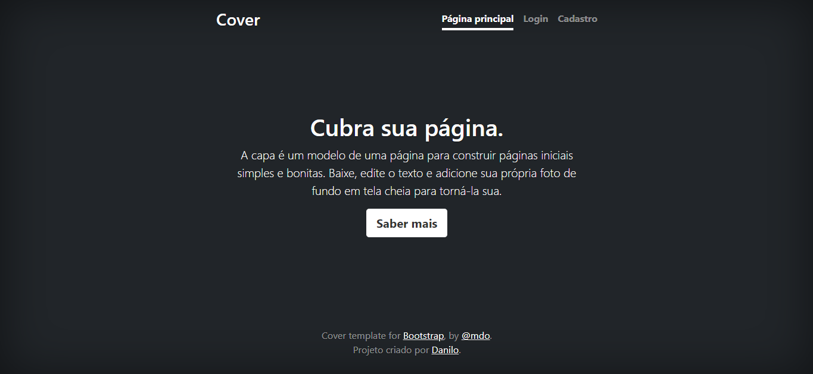
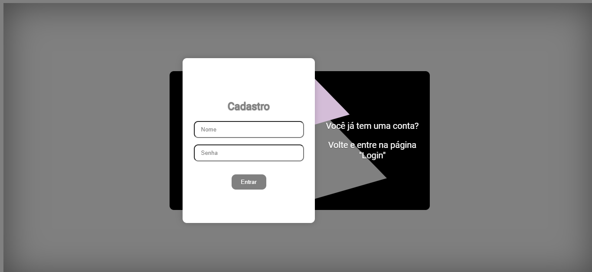

# Projeto do Dalinin
Bem-vindo ao repositório do ``Projeto do Dalinin``. Este projeto foi desenvolvido para criar uma interface de usuário ``simples`` e ``funcional`` utilizando ``HTML``, ``CSS``, e ``Bootstrap``. O projeto inclui três páginas principais: a ``página inicial``, a ``página de login`` e a ``página de cadastro``. Abaixo está uma descrição detalhada de cada um dos arquivos incluídos no projeto.

## Conteúdo do Repositório
+ Arquivos Principais
+ index.php - Página inicial do projeto.
+ login.php - Página de login para usuários registrados.
+ cadastro.php - Página de cadastro para novos usuários.

# Estrutura do Projeto
``index.php:`` Esta é a página inicial do projeto que exibe uma interface simples com um cabeçalho, um corpo principal e um rodapé. Inclui links para as páginas de login e cadastro.

``login.php:`` Esta página permite que usuários registrados façam login no sistema. Inclui campos de entrada para nome de usuário e senha.

``cadastro.php:`` Esta página permite que novos usuários se registrem no sistema. Inclui campos para inserir email, nome, sobrenome, nome de usuário e senha.

#  **Tecnologias utilizadas** 
[<code></code>](https://developer.mozilla.org/pt-BR/docs/Web/HTML)
[<code></code>](https://developer.mozilla.org/pt-BR/docs/Web/CSS)
[<code></code>](https://developer.mozilla.org/pt-BR/docs/Web/JavaScript)

[<code></code>](https://github.com/)
[<code></code>](https://code.visualstudio.com/)

``HTML 5:`` O HTML foi usado neste projeto para criar a estrutura e o conteúdo da página da web.

``CSS 3:`` O CSS foi usado neste projeto para estilizar e melhorar a apresentação visual da página.

``JavaScript:`` O JavaScript foi usado neste projeto para adicionar funcionalidades interativas à página.

# ✍️(◔◡◔) **Autor**

[Danilo Felype Lima](https://github.com/DaniloFelype)

  
  
